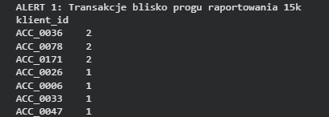
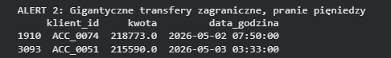
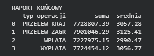

# Anti-Money Laundering (AML)

Skrypt analityczny przeznaczony dla departamentów Compliance i AML w sektorze bankowym, przetwarzający wolumeny danych transakcyjnych (10 000 rekordów) w celu wykrywania anomalii oraz prób oszustw finansowych. Narzędzie wykorzystuje bibliotekę Pandas do filtrowania wielowarunkowego, agregacji statystycznej oraz detekcji wzorców przestępczych, generując końcowe raporty biznesowe w wieloarkuszowych plikach MS Excel.

## Wyniki działania programu

